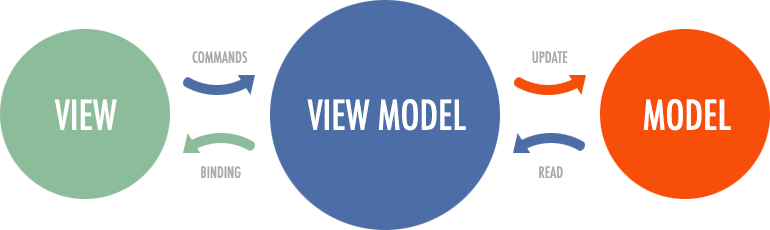

# Overview  

**mobx-view-model** is a library for integrating the [MVVM](https://en.wikipedia.org/wiki/Model%E2%80%93view%E2%80%93viewmodel) pattern with MobX and React.  

## Motivation  

The main goal of this library is to integrate the [MVVM](https://en.wikipedia.org/wiki/Model%E2%80%93view%E2%80%93viewmodel) architectural pattern with `React` and `MobX` reactivity.  

A key aspect of this integration is enabling strict isolation between business logic and presentation layers. By enforcing a clear separation through [ViewModels](/api/view-models/overview), developers can:
1. Encapsulate state management and business rules within observable [ViewModels](/api/view-models/overview)  
2. Keep React components focused only on rendering and user interactions  
3. Eliminate direct dependencies between UI components and domain models  

## Pros and cons  

Pros:  
 - More convenient separation of business logic from the presentation layer ([React](https://react.dev/)/etc).  
 - More flexible and seamless integration of the `React` ecosystem with `MobX`.  

Cons:  
 - An additional wrapper in the form of the [`withViewModel() HOC`](/react/api/with-view-model), which wraps the component in an extra layer. This wrapper further encloses the view component within [`observer()`](https://mobx.js.org/api.html#observer).  
 - Additional kilobytes for your bundle.  

## About MVVM  

[MVVM](https://en.wikipedia.org/wiki/Model%E2%80%93view%E2%80%93viewmodel) is an architectural pattern in computer software that facilitates the separation of the development of a graphical user interface (GUI; the view)—be it via a markup language or GUI code—from the development of the business logic or back-end logic (the model). This ensures the view is not dependent on any specific model platform.  

  
