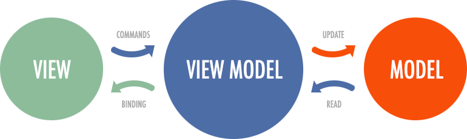

# Overview  

**mobx-view-model** is a library for integrating the [MVVM](https://en.wikipedia.org/wiki/Model%E2%80%93view%E2%80%93viewmodel) pattern with MobX and UI frameworks (**React**, **SolidJS**).  

## Motivation  

The main goal of this library is to integrate the [MVVM](https://en.wikipedia.org/wiki/Model%E2%80%93view%E2%80%93viewmodel) architectural pattern with UI frameworks and `MobX` reactivity.  

A key aspect of this integration is enabling strict isolation between business logic and presentation layers. By enforcing a clear separation through [ViewModels](/api/view-models/overview), developers can:
1. Encapsulate state management and business rules within observable [ViewModels](/api/view-models/overview)  
2. Keep view components focused only on rendering and user interactions  
3. Eliminate direct dependencies between UI components and domain models  

## Pros and cons  

Pros:  
 - More convenient separation of business logic from the presentation layer ([React](https://react.dev/), [SolidJS](https://www.solidjs.com/), etc).  
 - More flexible and seamless integration of the UI ecosystem with `MobX`.  

Cons:  
 - An additional wrapper in the form of the [`withViewModel()` HOC](/react/api/with-view-model) (React also wraps the view in [`observer()`](https://mobx.js.org/api.html#observer); Solid uses [mobx-solid](https://js2me.github.io/mobx-solid/) instead).  
 - Additional kilobytes for your bundle.  

## About MVVM  

[MVVM](https://en.wikipedia.org/wiki/Model%E2%80%93view%E2%80%93viewmodel) is an architectural pattern in computer software that facilitates the separation of the development of a graphical user interface (GUI; the view)—be it via a markup language or GUI code—from the development of the business logic or back-end logic (the model). This ensures the view is not dependent on any specific model platform.  

  

In MVVM, the `ViewModel` acts as a dedicated adaptation layer between the UI and domain logic. It exposes state and actions in a UI-friendly form, so components can focus on rendering and user interactions instead of orchestrating business rules.  

This pattern is especially useful for medium and large applications, where the same business behavior must be reused across multiple screens. By moving decision-making into `ViewModels`, teams get a more predictable architecture, simpler unit testing, and easier long-term maintenance because presentation code evolves independently from domain code.  

