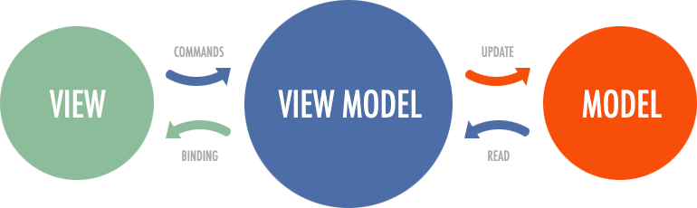

**mobx-view-model** - это библиотека для интеграции паттерна MVVM с MobX и React.  

## Мотивация  

Основная цель для чего нужна эта библиотека - удобная реализация паттерна MVVM.  

## Плюсы и минусы  

Плюсы:  
 - более удобное отделение бизнес-логики от слоя представления (`React`/etc).  
 - более гибкая и удобная интеграция `React` экосистемы (возможно в будущем и не только `React`) с `MobX`  

Минусы:  
 - дополнительная обёртка в виде `HOC` `withViewModel()`, которая оборачивает компонент в дополнительный компонент, который, в свою очередь, дополнительно оборачивает внешний компонент в [`observer()`](https://mobx.js.org/api.html#observer)    
 - дополнительные килобайты в ваш бандл  

## О MVVM  

[MVVM](https://en.wikipedia.org/wiki/Model%E2%80%93view%E2%80%93viewmodel) - это архитектурный паттерн в компьютерном программном обеспечении, который облегчает разделение разработки графического пользовательского интерфейса (GUI; представление) — будь то с использованием языка разметки или кода GUI — от разработки бизнес-логики или серверной логики (модель) таким образом, что представление не зависит от конкретной платформы модели.  

  
